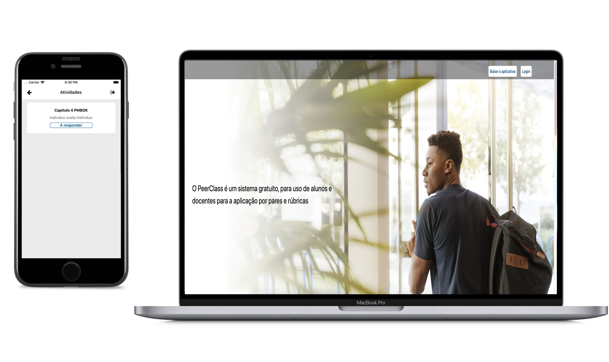

<h1 align="center">
    
</h1>

<h4 align="center">
  🚀 PeerClass
</h4>

  <a href="#rocket-tecnologias">Tecnologias</a>&nbsp;&nbsp;&nbsp;|&nbsp;&nbsp;&nbsp;
  <a href="#-sobre">Projeto</a>

 

  

## :rocket: Tecnologias

Esse projeto foi desenvolvido com as seguintes tecnologias:

- [Node.js](https://nodejs.org/en/)
- [React](https://reactjs.org)
- [React Native](https://facebook.github.io/react-native/)

## 💻 Sobre

PeerClass é um sistema para as plataformas web e dispositivos móveis, que permite aos professores a aplicação das técnicas
de Avaliação por Pares e com Rubricas para um grupo de alunos, 
com armazenamento de dados referentes a alunos, professores, atividades propostas e exames aplicados, 
para que se possa posteriormente analisar os resultados gerados durante as avaliações, oferecendo mais praticidade 
e organização se comparado ao trabalho manual realizado atualmente pelos docentes durante avaliações.

### + praticidade

É possível criar e consultar tarefas, notas e atribuir notas às atividades dos alunos com poucos cliques

### + organização

Com o PeerClass, é possível consultar os relatórios das atividades a qualquer momento, de forma rápida e intuitiva

### Acesse de qualquer lugar

Seja por aplicativos móveis ou pela web, os alunos poderão responder de qualquer lugar e atribuirem notas às atividades dos colegas em um piscar de olhos!

